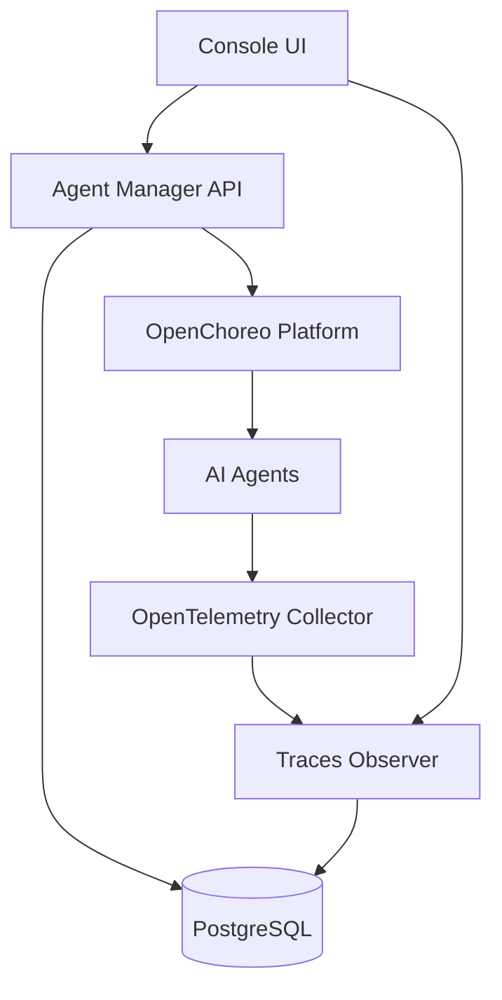

# What is AI Agent Management Platform?

An open control plane designed for enterprises to deploy, manage, and govern AI agents at scale.

## Overview

WSO2 AI Agent Management Platform provides a comprehensive platform for enterprise AI agent management. It enables organizations to deploy AI agents (both internally hosted and externally deployed), monitor their behavior through full-stack observability, and enforce governance policies at scale.

Built on [OpenChoreo](https://github.com/openchoreo/openchoreo) for internal agent deployments, the platform leverages OpenTelemetry for extensible instrumentation across multiple AI frameworks.

## Key Features

### Deploy at Scale
Deploy and run AI agents on Kubernetes with production-ready configurations. The platform handles:
- Container orchestration
- Resource management
- Auto-scaling
- High availability

### Lifecycle Management
Manage agent versions, configurations, and deployments from a unified control plane:
- Version control for agent deployments
- Configuration management
- Rollback capabilities
- Blue-green deployments

### Governance
Enforce policies, manage access controls, and ensure compliance across all agents:
- Policy enforcement
- Access control (RBAC)
- Audit logging
- Compliance reporting

### Full Observability
Capture traces, metrics, and logs for complete visibility into agent behavior:
- Distributed tracing with OpenTelemetry
- Metrics collection and visualization
- Log aggregation
- Performance monitoring

### Auto-Instrumentation
OpenTelemetry-based instrumentation for AI frameworks with zero code changes:
- Automatic trace generation
- Support for LangChain, LlamaIndex, and more
- Custom instrumentation support
- Framework-agnostic design

### External Agent Support
Monitor and govern externally deployed agents alongside internal ones:
- Unified observability
- Consistent governance policies
- Cross-environment visibility

## Architecture

The platform consists of several key components working together:

### Components

| Component | Description |
|-----------|-------------|
| **amp-instrumentation** | Python auto-instrumentation package for AI frameworks | 
| **amp-console** | Web-based management console for the platform |
| **amp-api** | Backend API powering the control plane | 
| **amp-trace-observer** | API for querying and analyzing trace data | 
| **amp-python-instrumentation-provider** | Kubernetes init container for automatic Python instrumentation |

## Use Cases

### Enterprise AI Agent Deployment
- Deploy multiple AI agents across different teams
- Centralized management and monitoring
- Consistent deployment patterns

### Multi-Environment Agent Management
- Manage agents across dev, staging, and production
- Environment-specific configurations
- Promotion workflows

### Compliance and Governance
- Audit all agent interactions
- Enforce usage policies
- Track agent performance and costs

### Development and Testing
- Rapid prototyping and testing
- Trace-driven debugging
- Performance optimization

## Getting Started

Ready to try it out? Check out our [Quick Start Guide](../getting-started/quick-start) to get the platform running in minutes.
